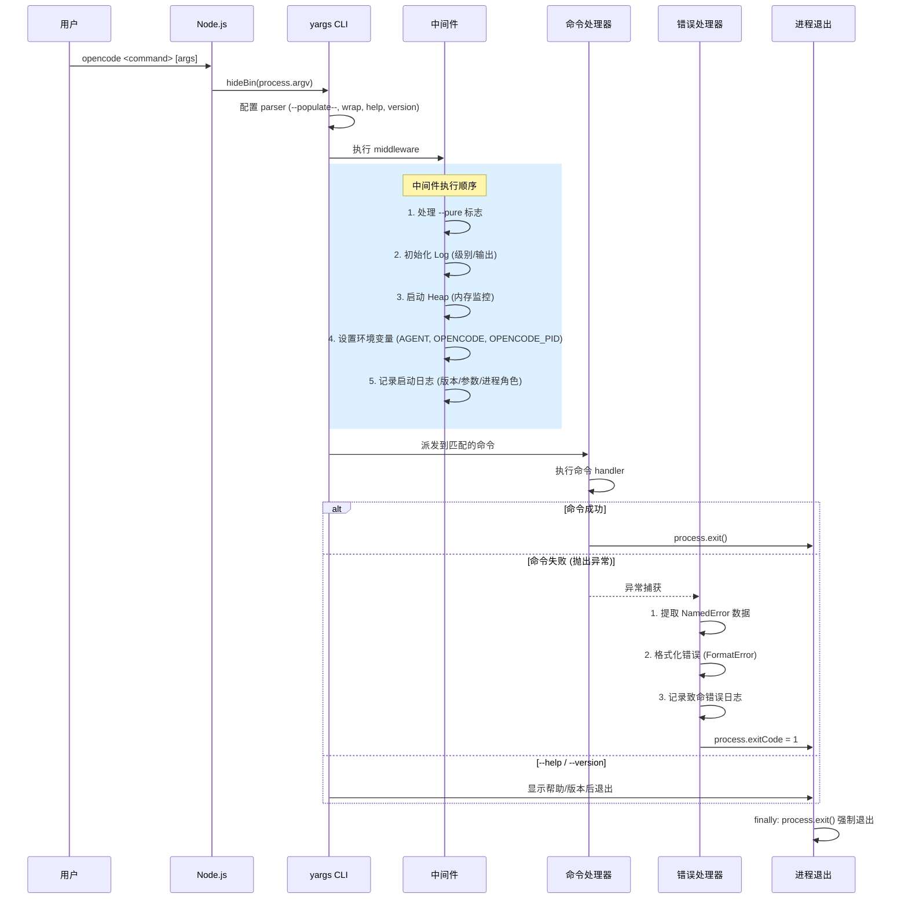

# 入口分析：`src/index.ts`

## 概述

`packages/opencode/src/index.ts` 是整个 opencode CLI 的入口文件。它使用 **yargs** 框架构建命令行解析器，注册所有子命令，并安装全局错误处理器。

---

## 时序图



---

## 核心逻辑分解

### 1. 进程元数据初始化

```
const processMetadata = ensureProcessMetadata("main")
```

在模块加载时立即执行，确保进程角色和 runID 已注册。

### 2. 全局异常处理

| 事件 | 处理方式 |
|------|----------|
| `unhandledRejection` | 通过 Log 记录 `"rejection"` 级别错误 |
| `uncaughtException` | 通过 Log 记录 `"exception"` 级别错误 |

### 3. yargs CLI 配置

```typescript
const cli = yargs(args)
  .parserConfiguration({ "populate--": true })  // 支持 -- 分隔符
  .scriptName("opencode")                       // 脚本名
  .wrap(100)                                    // 行宽
  .help("help", "show help")                    // --help
  .alias("help", "h")
  .version(...)                                 // --version
  .alias("version", "v")
  .option("print-logs")                         // 打印日志到 stderr
  .option("log-level")                          // 日志级别 (DEBUG/INFO/WARN/ERROR)
  .option("pure")                               // 无外部插件模式
  .middleware(...)                               // 请求处理中间件
  .usage("")
  .completion("completion", ...)                // shell 补全
  .strict()                                     // 严格模式
```

### 4. 注册的命令列表

| # | 命令 | 源文件 | 说明 |
|---|------|--------|------|
| 1 | `acp` | `./cli/cmd/acp` | Agent Client Protocol 服务 |
| 2 | `mcp` | `./cli/cmd/mcp` | Model Context Protocol 管理 |
| 3 | *默认* | `./cli/cmd/tui/thread` | TUI 交互式终端 |
| 4 | `attach` | `./cli/cmd/tui/attach` | 连接到远程 opencode 服务器 |
| 5 | `run` | `./cli/cmd/run` | 执行 prompt (核心) |
| 6 | `generate` | `./cli/cmd/generate` | 生成 OpenAPI SDK |
| 7 | `debug` | `./cli/cmd/debug` | 调试工具子命令 |
| 8 | `account` | `./cli/cmd/account` | 账户管理 |
| 9 | `providers` | `./cli/cmd/providers` | 提供商管理 |
| 10 | `agent` | `./cli/cmd/agent` | Agent 配置管理 |
| 11 | `upgrade` | `./cli/cmd/upgrade` | 升级 |
| 12 | `uninstall` | `./cli/cmd/uninstall` | 卸载 |
| 13 | `serve` | `./cli/cmd/serve` | 启动无头服务器 |
| 14 | `web` | `./cli/cmd/web` | Web 界面 |
| 15 | `models` | `./cli/cmd/models` | 列出模型 |
| 16 | `stats` | `./cli/cmd/stats` | 统计信息 |
| 17 | `export` | `./cli/cmd/export` | 导出会话 |
| 18 | `import` | `./cli/cmd/import` | 导入会话 |
| 19 | `github` | `./cli/cmd/github` | GitHub 集成 |
| 20 | `pr` | `./cli/cmd/pr` | PR checkout + run |
| 21 | `session` | `./cli/cmd/session` | 会话管理 |
| 22 | `plugin` | `./cli/cmd/plug` | 插件管理 |
| 23 | `db` | `./cli/cmd/db` | 数据库交互 |

### 5. 中间件执行流程

中间件在每次 CLI 调用时按以下顺序执行：

1. **`--pure` 检查**: 如果指定，设置 `OPENCODE_PURE=1` 环境变量
2. **日志初始化**: `Log.init()` 确定日志级别和输出目标
   - 本地开发: `DEBUG` 级别
   - 生产: `INFO` 级别
   - `--log-level` 可覆盖
3. **Heap 监控启动**: `Heap.start()` 监控内存使用，超 2GB 自动快照
4. **环境变量设置**:
   - `AGENT=1`
   - `OPENCODE=1`
   - `OPENCODE_PID=<pid>`
5. **启动日志**: 记录版本、参数、进程角色、runID

### 6. 错误处理

```
catch (e) {
  1. 构造 data 记录
  2. 如果是 NamedError → 提取结构化数据
  3. 如果是 ResolveMessage → 提取解析错误信息
  4. Log.Default.error("fatal", data)
  5. FormatError(e) → UI.error() 格式化输出
  6. 未格式化错误 → 输出原始错误 + 日志路径
  7. process.exitCode = 1
}
finally {
  process.exit()  // 强制退出，防止子进程挂起
}
```

### 7. 强制退出策略

`finally` 块中调用 `process.exit()`，这是为了防止某些子进程（特别是 Docker 容器中的 MCP 服务器）在 SIGTERM 等信号下不响应。通过显式退出确保所有子进程终止。

---

## 技术要点

| 方面 | 说明 |
|------|------|
| CLI 框架 | yargs — 支持命令注册、参数解析、自动帮助/版本、中间件 |
| 日志系统 | `@opencode-ai/core/util/log` — 支持级别控制、文件输出、结构化记录 |
| 错误类型 | `NamedError` (结构化错误)、`Schema.TaggedErrorClass` (Effect 风格) |
| 分析追踪 | `Heap` (V8 堆快照)、`processMetadata` (进程角色/runID) |
| 进程管理 | 全局异常处理器 + `finally` 强制退出 |
| 模块导入 | 动态 import (通过 `effectCmd`) + 静态 import |
