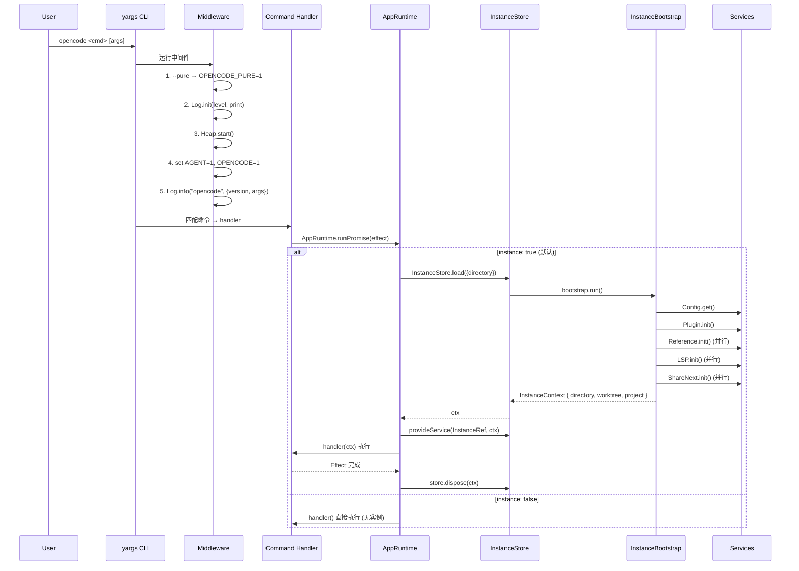
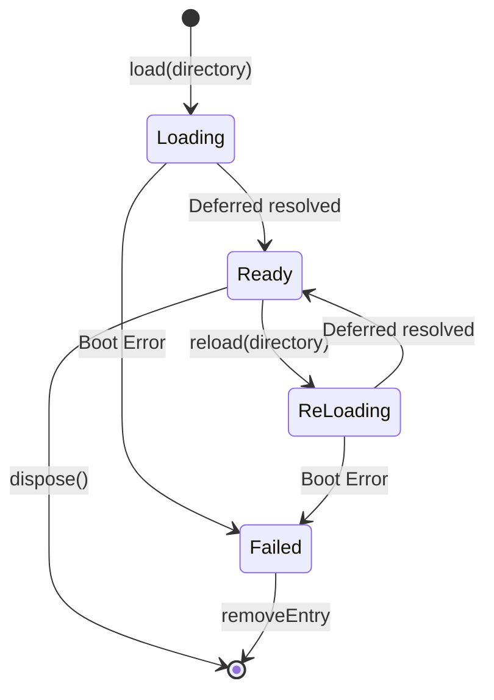
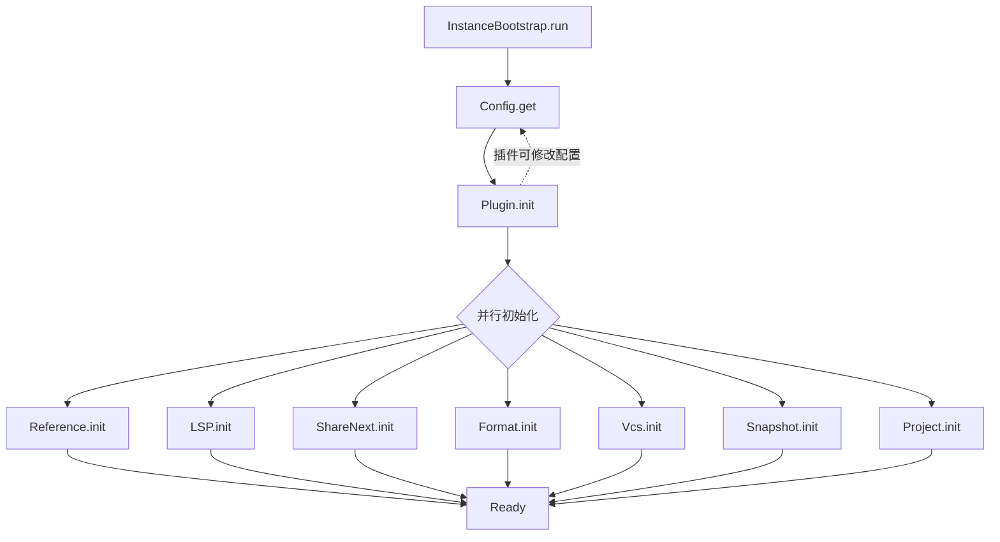
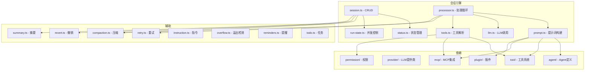
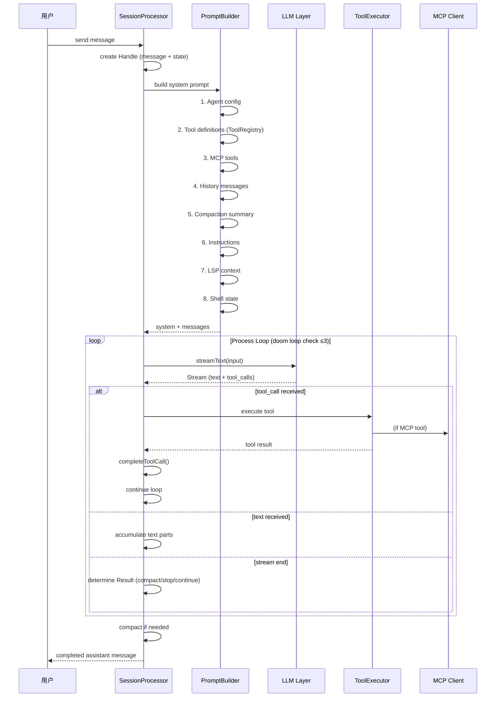
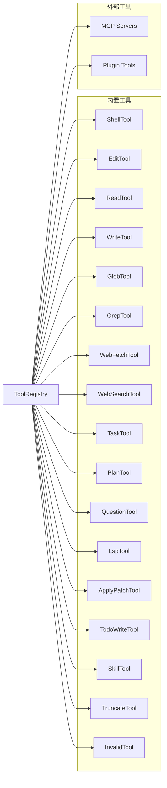
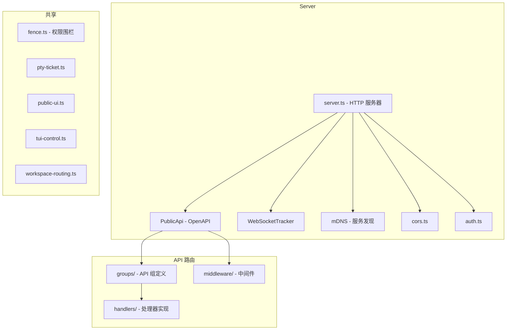
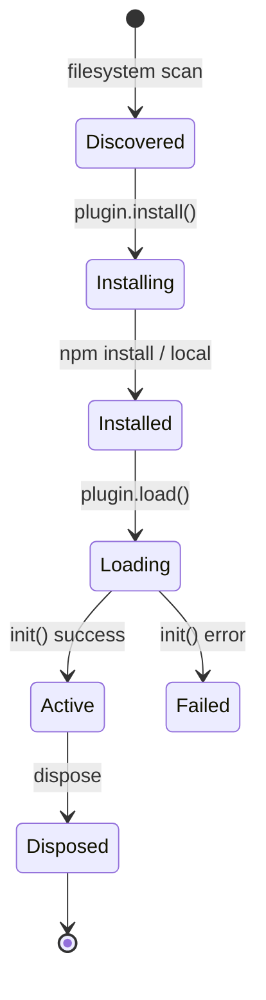

# 各模块详细分析

---

## 1. CLI 入口模块 (`src/index.ts`)

### 时序图



### 技术实现

| 方面 | 细节 |
|------|------|
| 框架 | `yargs` — populates `--`, strict mode, middleware |
| 全局错误 | `process.on("unhandledRejection")`, `process.on("uncaughtException")` |
| 日志初始化 | 基于 `@opencode-ai/core/util/log`，条件化级别 (DEBUG/INFO) |
| 内存监控 | `heap.ts` — 2GB 阈值自动 V8 堆快照 |
| 强制退出 | `finally { process.exit() }` 防止子进程挂起 |
| 版本 | `InstallationVersion` 从 core 包导入 |

### 注册的 23 个命令

`acp, mcp, (默认TUI), attach, run, generate, debug, account, providers, agent, upgrade, uninstall, serve, web, models, stats, github, export, import, pr, session, plugin, db`

---

## 2. CLI 命令包装器 (`src/cli/effect-cmd.ts`)

### 功能

将 yargs 命令包装为 Effect 风格的处理器，自动管理 Instance 生命周期。

### `effectCmd` 参数

| 参数 | 类型 | 默认值 | 说明 |
|------|------|--------|------|
| `command` | string \| string[] | 必填 | 命令名 |
| `describe` | string \| false | 必填 | 描述 |
| `builder` | yargs builder | 可选 | 参数定义 |
| `instance` | boolean \| (args) => boolean | `true` | 是否需要实例 |
| `directory` | (args) => string | `process.cwd()` | 项目目录 |
| `handler` | Effect | 必填 | 处理器 |

### 自动处理

- `instance=true`: 自动 `InstanceStore.load()` + `provideService(InstanceRef)` + `finally dispose`
- `instance=false`: 直接运行，跳过实例加载
- 错误统一抛到 `src/index.ts` 的全局 catch

### CliError 类

```typescript
class CliError extends Schema.TaggedErrorClass<CliError>()("CliError", {
  message: Schema.String,
  exitCode: Schema.optional(Schema.Number),
})
```

---

## 3. 应用运行时 (`src/effect/app-runtime.ts`)

### 合并的服务层

共约 **40 个服务**：

```
Npm, FSUtil, Database, Auth, Account, Config, Git, Ripgrep,
Storage, Snapshot, Plugin, ModelsDev, Provider, ProviderAuth,
Agent, Skill, Discovery, Question, Permission, Todo, Session,
SessionStatus, BackgroundJob, RuntimeFlags, EventV2Bridge,
SessionRunState, SessionProcessor, SessionCompaction,
SessionRevert, SessionSummary, SessionPrompt, Instruction,
LLM, LSP, MCP, McpAuth, Command, Truncate, ToolRegistry,
Format, Project, Vcs, Reference, Workspace, Worktree,
Installation, ShareNext, SessionShare
```

### 提供的方法

| 方法 | 说明 |
|------|------|
| `runSync(effect)` | 同步运行 |
| `runPromise(effect)` | 返回 Promise |
| `runPromiseExit(effect)` | 返回 Exit |
| `runFork(effect)` | 后台 fiber |
| `runCallback(effect)` | 回调风格 |
| `dispose()` | 释放所有资源 |

所有方法都通过 `attach()` 包装，自动从调用 fiber 传播 `InstanceRef` 和 `WorkspaceRef`。

### 核心代码

```typescript
const rt = ManagedRuntime.make(AppLayer, { memoMap })
// memoMap 确保层去重
```

---

## 4. 实例管理 (`src/project/instance-store.ts`, `src/effect/instance-state.ts`)

### InstanceStore 接口

```typescript
interface Interface {
  load(input: LoadInput): Effect<InstanceContext>       // 加载实例
  reload(input: LoadInput): Effect<InstanceContext>     // 重载
  dispose(ctx: InstanceContext): Effect<void>           // 释放
  disposeDirectory(directory: string): Effect<void>     // 按目录释放
  disposeAll(): Effect<void>                            // 全部释放
  provide(input, effect): Effect                        // 上下文包装
}
```

### 实例生命周期状态机



### InstanceState (按目录缓存)

```typescript
interface InstanceState<A, E, R> {
  readonly cache: ScopedCache<string, A, E, R>  // key = directory
}
```

- `make(init)`: 创建 InstanceState，`init` 接收 `InstanceContext`
- `get(self)`: 获取当前目录缓存值
- `use/useEffect`: 映射/效果映射缓存值
- `invalidate`: 清除缓存
- 自动注册 `disposer`，实例释放时清理

### 启动顺序



---

## 5. 会话引擎 (`src/session/`)

### 模块关系



### 会话处理循环



### LLM 调用路径

```
SessionProcessor
  → SessionPrompt (1755行)
    → SessionTools.resolve() → ToolRegistry + MCP + Permission
    → System prompt assembly (agent, instructions, history, etc.)
    → LLM.Service
      → AI SDK streamText (默认)
        → wrapLanguageModel (middleware: guardrails, logging, OpenTelemetry)
      → OR NativeRuntime (自定义 provider)
        → LLMClient / RequestExecutor / WebSocketExecutor
```

---

## 6. 工具系统 (`src/tool/`)

### 工具注册表



### 工具解析流程 (`SessionTools.resolve`)

```
输入: { agent, model, session, handle, messages }
  ↓
1. 获取 ToolRegistry.all() → 内置工具定义
2. 获取 MCP.list() → MCP 工具定义
3. 获取 Plugin.list() → 插件工具定义
4. 根据 agent 配置过滤 (exclude/include)
5. 根据权限过滤 (Permission.evaluate)
6. 根据模型兼容性过滤
7. 创建 AI SDK Tool 定义 (with execute wrapper)
  ↓
输出: Record<string, AITool>
```

### Shell 工具 (`tool/shell.ts`)

| 功能 | 说明 |
|------|------|
| Shell 检测 | bash, zsh, fish, sh, powershell, cmd, nu |
| 进程管理 | `spawn`, `killTree` (SIGTERM → 超时 → SIGKILL) |
| CWD 追踪 | 检测 cd/pushd 等目录变更 |
| 临时目录 | 管理每个会话的临时工作区 |
| 输出限制 | 自动截断过长输出 |

---

## 7. LLM 提供商 (`src/provider/`)

### 模块结构

```
provider/
├── provider.ts   (2004行) - 提供商配置、模型管理、包解析
├── transform.ts  (1363行) - 消息格式转换、模态路由
├── auth.ts       - 提供商认证
├── error.ts      - 错误类型
└── model-status.ts - 模型状态
```

### 核心功能

1. **提供商配置**: 管理 OpenAI, Anthropic, Google, AWS Bedrock, Azure, Ollama 等
2. **模型解析**: 支持 fuzzy search, 按提供商过滤, 上下文大小查询
3. **请求转换** (`transform.ts`):
   - 内部消息 ↔ AI SDK 格式
   - 模态路由 (文本/图像/音频/PDF 路由到合适的提供商)
   - Reasoning token 处理
   - Output limits

### Provider 插件支持

| 插件 | 提供商 |
|------|--------|
| `plugin/openai/codex.ts` | OpenAI Codex |
| `plugin/openai/ws.ts` | OpenAI WebSocket |
| `plugin/openai/ws-pool.ts` | OpenAI WS 连接池 |
| `plugin/github-copilot/` | GitHub Copilot |
| `plugin/azure.ts` | Azure |
| `plugin/cloudflare.ts` | Cloudflare AI |
| `plugin/digitalocean.ts` | DigitalOcean |
| `plugin/xai.ts` | xAI |

---

## 8. 服务器 (`src/server/`)

### 架构



### API 组

```typescript
// groups/ 目录下的 21 个 API 组:
config, control-plane, control, event, experimental, file,
global, instance, mcp, metadata, permission, project-copy,
project, provider, pty, query, question, session, sync, tui, workspace
```

### 中间件链

```
request
  → authorization (认证/授权)
  → compression (响应压缩)
  → cors-vary (CORS)
  → error (错误处理)
  → fence (权限围栏)
  → instance-context (实例上下文注入)
  → proxy (代理转发)
  → schema-error (Schema 验证错误)
  → workspace-routing (工作区路由)
  → handler
```

---

## 9. 插件系统 (`src/plugin/`)

### 插件生命周期



### 插件类型

| 类型 | 说明 |
|------|------|
| Provider 插件 | 添加新的 LLM 提供商支持 |
| Tool 插件 | 注册自定义工具 |
| Workspace 插件 | 工作区适配器 |
| Auth 插件 | 认证/凭据管理 |

### 核心文件

| 文件 | 说明 |
|------|------|
| `index.ts` | 主模块: 插件加载、生命周期、工具注册 |
| `loader.ts` | 插件加载器: npm/本地路径解析 |
| `meta.ts` | 插件元数据: 来源、版本、更新时间 |
| `install.ts` | 安装逻辑 |
| `shared.ts` | 共享工具: specifier 解析、ID 解析 |

---

## 10. MCP 集成 (`src/mcp/`)

### 传输协议支持

| 协议 | 说明 |
|------|------|
| **stdio** | 子进程 stdin/stdout |
| **SSE** | Server-Sent Events |
| **Streamable HTTP** | HTTP 流式传输 |

### 认证支持

- OAuth 授权码流程 (`oauth-provider.ts`)
- OAuth 回调服务器 (`oauth-callback.ts`)

### 核心流程

```
MCP Server 配置
  ↓
Client 连接 (stdio/SSE/HTTP)
  ↓
工具列表获取 (tools/list)
  ↓
工具注册到 ToolRegistry
  ↓
会话期间工具调用 (tools/call)
  ↓
自动重连 (断线后 reconnect)
```

---

## 11. TUI (终端 UI) (`src/cli/cmd/tui/`)

### 架构

```mermaid
graph TB
    subgraph TUI 架构
        THREAD[thread.ts - 入口]
        WORKER[worker.ts - 后台Worker]
        APP[app.tsx - SolidJS 应用]
        ROUTES[routes/ - 路由]
        COMPONENTS[components/ - UI组件]
        CONTEXT[context/ - 上下文/状态]
    end

    subgraph 通信
        RPC[RPC (worker ↔ TUI)]
        EVENT[Event Bus → EventSource]
        FETCH[Fetch Proxy → Server]
    end

    subgraph Worker 内部
        LOG[Logging]
        HEAP[Heap Monitor]
        SERVER[In-process HTTP Server]
        GLOBAL_BUS[GlobalBus → RPC]
    end

    THREAD -->|new Worker| WORKER
    THREAD -->|createWorkerFetch| FETCH
    THREAD -->|createEventSource| EVENT
    THREAD --> APP
    
    WORKER --> SERVER
    WORKER --> GLOBAL_BUS
    WORKER --> LOG
    WORKER --> HEAP
    
    APP --> ROUTES
    APP --> COMPONENTS
    APP --> CONTEXT
    APP --> FETCH
    APP --> EVENT
```

### 运行模式

| 模式 | 描述 |
|------|------|
| `opencode` (无命令) | 全屏 TUI，启动 worker + in-process server |
| `opencode --attach <url>` | 连接到远程 server 的 TUI |
| `opencode run --interactive` | 分割页脚模式 (scrollback + 7行 footer) |

### TUI 页面路由

```
Home (/)
  ├── session-destination (新建/最近会话)
  └── tips-view (提示)

Session (/session/:id)
  ├── sidebar (侧边栏: context, files, lsp, mcp, todo)
  ├── footer (操作栏)
  ├── permission (权限请求)
  ├── question (问题)
  ├── subagent-footer (子agent操作栏)
  └── dialogs:
      ├── fork-from-timeline
      ├── message
      ├── subagent
      └── timeline
```

### 组件分类

| 类别 | 组件 |
|------|------|
| 提示 Prompt | autocomplete, cwd, frecency, history, stash, workspace |
| 对话框 Dialog | agent, console-org, mcp, model, move-session, retry, session, skill, stash, tag, theme, variant, workspace |
| UI | alert, confirm, help, prompt, select, link, spinner, toast |
| 特性插件 | home(tips), session(preview), sidebar(files/lsp/mcp/todo), system(diff-viewer, notifications, plugins) |

---

## 12. Run 交互式运行时 (`src/cli/cmd/run/`)

### 数据流

```mermaid
flowchart LR
    SDK[SDK Events] --> REDUCER[session-data.ts reducer]
    REDUCER --> COMMITS[StreamCommit[]]
    REDUCER --> FOOTER[FooterOutput]
    COMMITS --> STREAM[stream.ts bridge]
    FOOTER --> STREAM
    STREAM --> FOOTER_API[footer.ts API]
    FOOTER_API --> RENDERER[OpenTUI Split-Footer Renderer]
    
    RUNTIME[runtime.ts orchestrator] --> BOOT[runtime.boot.ts]
    RUNTIME --> TRANSPORT[stream.transport.ts]
    RUNTIME --> LIFECYCLE[runtime.lifecycle.ts]
    TRANSPORT --> REDUCER
    TRANSPORT --> REPLAY[Replay on resume]
```

### 关键类型

| 类型 | 说明 |
|------|------|
| `RunInput` | 运行时完整输入 (client, directory, session, model, etc) |
| `SessionData` | 可变的会话状态 (reducer 内部) |
| `StreamCommit` | 不可变的滚动缓冲区条目 |
| `FooterOutput` | Footer 状态补丁 + 视图切换 |
| `FooterState` | Footer 状态快照 (phase, status, queue, model, duration) |
| `FooterApi` | Footer 操作 API (append, event, prompt, interrupt) |

### 提示队列

```
prompt (当前活动) → streamTransport → reducer → stream → footer
queue (FIFO 队列) → (等待当前活动完成) → 同上
```

---

## 13. 事件总线 (`src/bus/global.ts`)

```typescript
type GlobalEvent = {
  directory?: string    // 所属目录
  project?: string     // 所属项目
  workspace?: string   // 所属工作区
  payload: any         // 事件体 (含 type 字段)
}

// 基于 Node EventEmitter 的全局单例
const GlobalBus: GlobalBusEmitter
```

### 使用模式

任意模块通过 `GlobalBus.emit("event", data)` 发送事件，消费者通过 `GlobalBus.on("event", handler)` 监听。

### 典型事件

| 事件 | 发送者 | 说明 |
|------|--------|------|
| `server.instance.disposed` | InstanceStore | 实例已释放 |
| `session.status.updated` | SessionStatus | 会话状态变更 |
| `permission.asked` | Permission | 权限请求 |
| `permission.replied` | Permission | 权限回复 |

---

## 14. 权限系统 (`src/permission/`)

### 核心概念

```
权限评估:
  输入: { action, tool, path, ... }
  输出: { allowed: boolean, reason?: string }

权限规则源:
  - Agent 配置 (agent.permissions)
  - 用户配置 (opencode.json permissions)
  - 会话上下文
  - 子 agent 继承
```

### Pending 请求

```typescript
interface PendingEntry {
  deferred: Deferred<boolean>  // 等待用户/插件回复
  event: Permission.Event
}
```

---

## 15. 文件大小统计

| 模块 | 关键大文件 | 总大小 (估算) |
|------|-----------|--------------|
| `session/` | `prompt.ts` (1755), `session.ts` (1116), `processor.ts` (1063) | ~6500 行 |
| `tool/` | `registry.ts` (471), `shell.ts` (660) | ~6000 行 |
| `provider/` | `provider.ts` (2004), `transform.ts` (1363) | ~3500 行 |
| `server/` | handlers + groups + middleware | ~5000 行 |
| `cli/cmd/run/` | `stream.transport.ts` (1465), `runtime.ts` (879), `session-data.ts` (1113) | ~4500 行 |
| `cli/cmd/tui/` | `app.tsx` (1113) + 组件 | ~15000 行 |
| `plugin/` | 各适配器 | ~2000 行 |
| `mcp/` | `index.ts` (982) | ~1000 行 |
| 总计 | | ~45000 行 |
